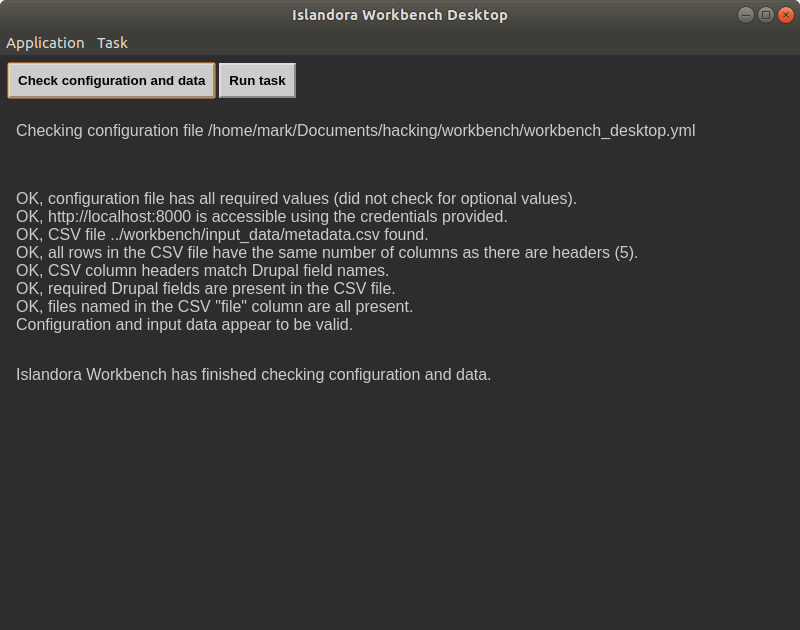
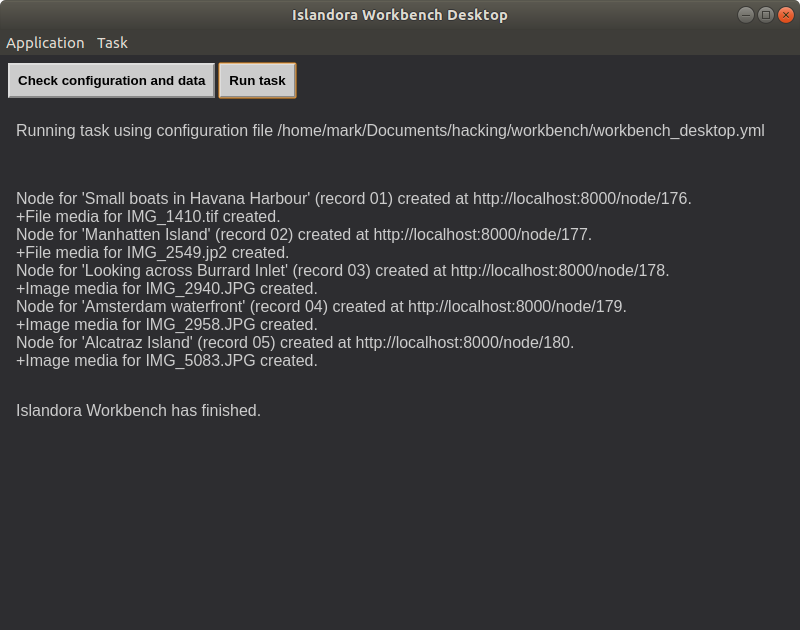
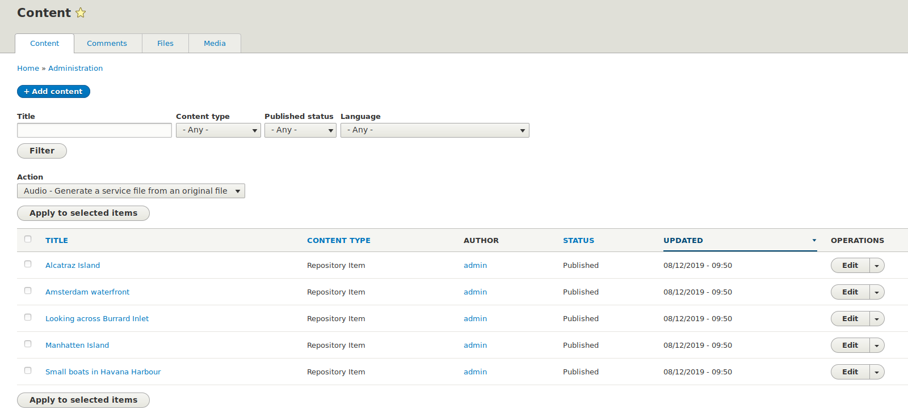
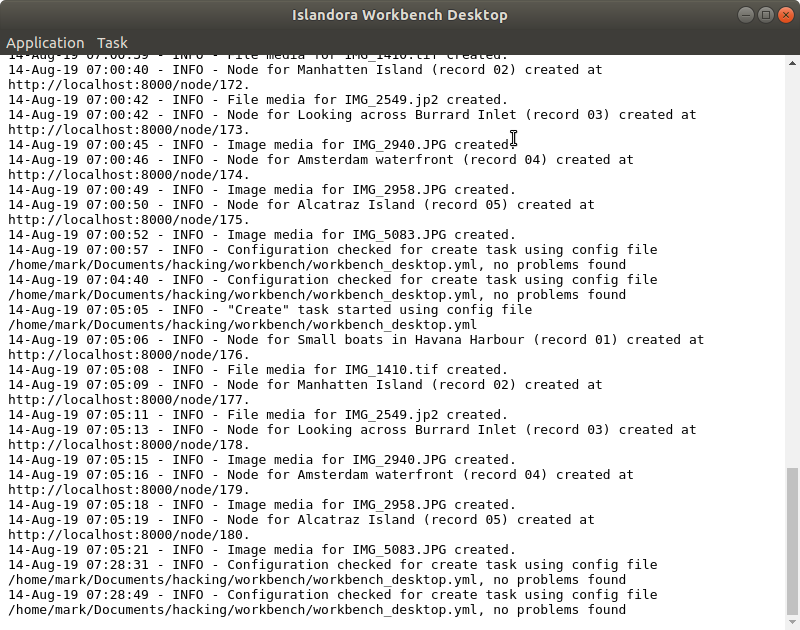

# Islandora Workbench Desktop

A proof of concept illustrating how an Electron application can be run on top of the [Islandora Workbench](https://github.com/mjordan/islandora_workbench) command-line tool. 

## Requirements

* [Islandora Workbench](https://github.com/mjordan/islandora_workbench)
* [Electron](https://electronjs.org/docs/tutorial/installation)

## Installation

1. Install Islandora Workbench.
1. Install Electron.
1. `git clone https://github.com/mjordan/islandora_workbench_desktop.git`. It is best (see below) that you clone this repository into a directory that is a sibling of the directory that Islandora Workbench is installed in.
1. `npm install`
1. Copy the `workbench_desktop.yml` file into the Islandora Workbench directory.

## Usage

### Preparing configuration files

You can use Workbench Desktop with any Islandora Workbench configuration file, with one difference: all file paths in configuration files must be absolute or relative to the Workbench Destop directory. For example, if Islandora Workbench and Islandora Workbench Desktop are installed in sibling directories, the relative file path in the `input_dir` configuration setting would look like this:

```yaml
input_dir: ../workbench/input_data
```

A sample configuration file, `workbench_desktop.yml`, is included with Workbench Desktop to illustrate this requirement.

### Running Workbench Desktop

1. Make sure your Islandora instance is running.
1. In the Islandora Workbench Desktop directory, open a terminal and run `npm start` (we will eventually provide a clickable icon for Workbench Desktop, like any other desktop application has).
1. You will need to tell Workbench Desktop where the `workbench` exectuble script is. To do this, open the "Application" menu and choose the "Set path to workbench" item. A file selector dialog box will appear; browse to the `workbench` script and select it. *You only need to do this once,* not every time you run Workbench Desktop.
1. To execute Workbench Desktop, you will need to select a configuration file. To do this, open the "Task" menu and choose "Choose a configuration file". Only YAML files show up in this file chooser.
1. After you've selected your configuration file, you are ready to check your configuration and data. Click on the "Check configuration and data" button. You will then see the output of Workbench's checks:


    


1. If the checks pass, you can then run the task (create new content, update content, etc.). Click on the "Run task" button. You will then see the output of the task. As each node and media is created/updated/deleted, a message will be added to the output. When finished, it will look similar to this, depending on the task:


    

If you ran a create task (for example), the nodes and media will be in your Islandora instance:



### Viewing the Workbench log

To view Workbench's log file, open the "Applicaiton" menu and choose "View log file", or hit Ctrl-l (L). The log (which currently must be in the default location) will appear:



To return to the main window, open the "Applicaiton" menu and choose "Return to main window", or hit Ctrl-m.


## License

The Unlicense.
