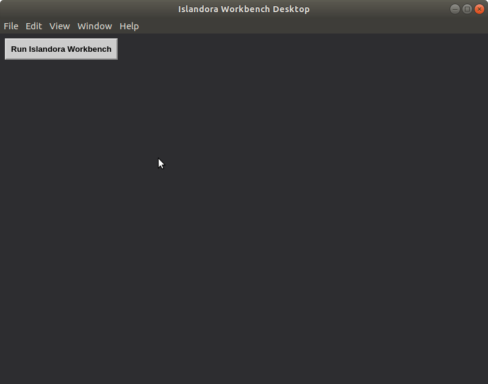
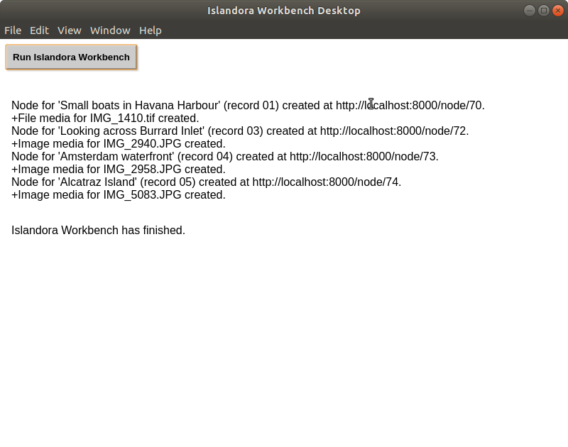

# Islandora Workbench Desktop

A proof of concept illustrating how an Electron application can be run on top of the [Islandora Workbench](https://github.com/mjordan/islandora_workbench) command-line tool. 

## Requirements

* [Islandora Workbench](https://github.com/mjordan/islandora_workbench)
* [Electron](https://electronjs.org/docs/tutorial/installation)

## Installation

1. Install Islandora Workbench.
1. Install Electron.
1. `git clone https://github.com/mjordan/islandora_workbench_desktop.git`. It is best (see below) that you clone this repository into a directory that is a sibling of the directory that Islandora Workbench is installed in.
1. `npm install`
1. Copy the `workbench_desktop.yml` file into the Islandora Workbench directory.

## Usage

Since this (extremely basic) proof of concept hard-codes the path to Islandora Workbench, you may need to adjust the path to `workbench` and the configuration file in the main.js file:

```javascript
// You may need to adjust the path to the workbench configuration file, and also
// the path in the 'input_dir' option with the configuration file. All paths must
// be relative to the Islandora Workbench Desktop directory.
args: ['--config', '../workbench/workbench_desktop.yml']
```
and

```javascript
// You may need to adjust the path to workbench so that is it relative to
// the Islandora Workbench Desktop directory.
let shell = new PythonShell('../workbench/workbench', options);
```

And in the `workbench_desktop.yml` file, adjust the path to the Workbench `input_dir` so that is is also relative to the Desktop directory:

```yaml
input_dir: ../workbench/input_data
```

After you adjust the paths, from within the islandora_workbench_desktop directory, run:

`npm start`

You will see this:



Then click on the "Run Islandora Workbench" button. As each node and media is created, a message will be added to the output. When finished, it will look like this:




And you should have some nodes in your Islandora instance.

## License

The Unlicense.
