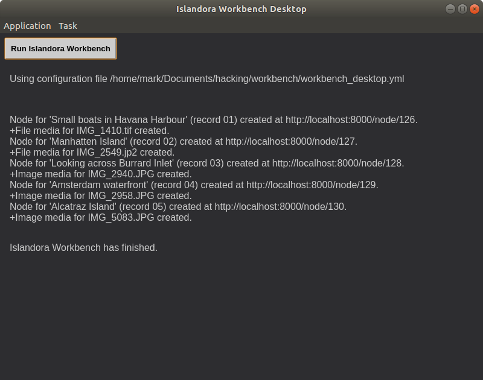

# Islandora Workbench Desktop

A proof of concept illustrating how an Electron application can be run on top of the [Islandora Workbench](https://github.com/mjordan/islandora_workbench) command-line tool. 

## Requirements

* [Islandora Workbench](https://github.com/mjordan/islandora_workbench)
* [Electron](https://electronjs.org/docs/tutorial/installation)

## Installation

1. Install Islandora Workbench.
1. Install Electron.
1. `git clone https://github.com/mjordan/islandora_workbench_desktop.git`. It is best (see below) that you clone this repository into a directory that is a sibling of the directory that Islandora Workbench is installed in.
1. `npm install`
1. Copy the `workbench_desktop.yml` file into the Islandora Workbench directory.

## Usage

1. Make sure your Islandora instance is running.
1. Copy the `workbench_desktop.yml` file provided with Workbench Desktop into the Workbench directory.
1. In the Islandora Workbench Desktop directory, open a terminal and run `npm start`.
1. You will need to tell Workbench Desktop where the `workbench` exectuble script is. To do this, open the "Application" menu and choose the "Set path to workbench" item. A file selector dialog box will appear; browse to the `workbench` script and select it. You only need to do this once, not every time you run Workbench Desktop.
1. To execute Workbench Desktop, you will need to select a configuration file. To do this, open the "Task" menu and choose "Choose a configuration file". No surprises here, it's an ordinary file open dialog.
1. After you've selected your configuration file, you are ready to click on the "Run Islandora Workbench" button. You will then see the ingest happening. As each node and media is created, a message will be added to the output. When finished, it will look like this:



And the nodes and media will be in your Islandora instance:


## Paths in your configuration file

In your workbench configuration files, paths will need to be relative to the directory where Islandora Workbench Desktop is running. For example, in the sample `workbench_desktop.yml` file, adjust the path to the Workbench `input_dir` so that is is also relative to the Desktop directory:

```yaml
input_dir: ../workbench/input_data
```

This path assumes that `workbench` and Workbench Desktop are in sibling directories.

## License

The Unlicense.
